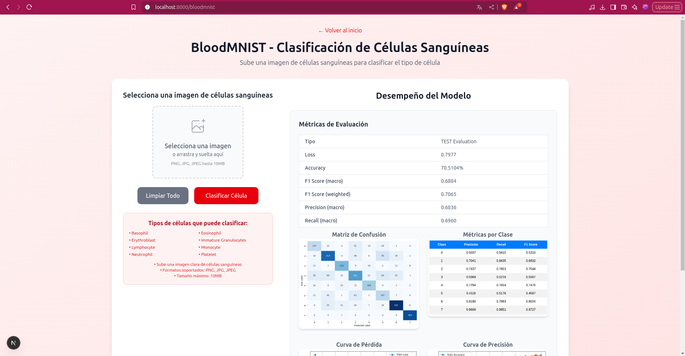

# VTCNN - Clasificador Híbrido de Redes Convolucionales y Transformadores Visuales

El proyecto VTCNN implementa un modelo híbrido que combina Redes Convolucionales (CNN) y Transformadores Visuales para tareas de clasificación de imágenes. Este sistema soporta múltiples conjuntos de datos, configuraciones de hardware y una interfaz web para visualización y predicción.

## Características

- **Conjuntos de datos soportados**: MNIST, FashionMNIST y BloodMNIST.
- **Soporte de hardware**: Ejecución en CPU o GPU (CUDA, opcional).
- **Interfaz frontend**: Aplicación web para visualizar métricas de entrenamiento y realizar predicciones con imágenes personalizadas.
- **Interfaz de línea de comandos**: Entrenamiento y predicción automatizados mediante el script `run.sh`.

---

## Arquitectura del Modelo

El modelo VTCNN integra redes convolucionales para la extracción de características, transformadores visuales para modelar relaciones globales y capas densas para la clasificación final. La arquitectura se estructura de la siguiente manera:

1. **Capas Convolucionales**: Extraen características locales de las imágenes de entrada.
2. **Transformador Visual**: Modela dependencias globales utilizando mapas de características tokenizados.
3. **Capas Densas**: Realizan la clasificación final con una salida softmax.

### Diagrama de Arquitectura


### Flujo Detallado del Modelo

- **Entrada**: Imágenes de tamaño 28×28 (escala de grises, 1 canal).
- **Etapa Convolucional**: Aplica Conv2D (de 1 a 4 canales) y normalización por lotes (BatchNorm).
- **Tokenización**: Reformatea las características en tokens para el transformador.
- **Etapa de Transformador**: Utiliza atención multicabezal con proyección.
- **Etapa de Salida**: Aplica MaxPool, Flatten y capas densas para la clasificación.
- **Activación**: Softmax para predicciones multiclase.

---

## Requisitos

### Backend (C++)

- **CMake**: Versión 3.10 o superior.
- **Compilador**: GCC o Clang compatible con C++17.
- **CUDA Toolkit**: Opcional, necesario para soporte de GPU.
- **Dependencias**: Bibliotecas estándar de C++; no se requieren bibliotecas externas salvo para CUDA.

### Frontend (Next.js)

Para instalar las dependencias del frontend, navegue al directorio `frontend` y ejecute:

```bash
cd frontend
npm install
```

---

## Estructura del Proyecto

El proyecto está organizado de la siguiente manera:

```
.
├── blood_data/              # Conjunto de datos BloodMNIST (entrenamiento, prueba, validación)
├── fashion_data/            # Conjunto de datos FashionMNIST (entrenamiento, prueba)
├── mnist_data/              # Conjunto de datos MNIST (entrenamiento, prueba)
├── custom_images/           # Imágenes personalizadas para predicción
├── save_models/             # Archivos de modelos entrenados (.bin)
├── layers/                  # Implementaciones de capas (Conv2D, Transformer, etc.)
├── model/                   # Definiciones de modelos (MLP, VTCNN)
├── utils/                   # Utilidades (cargador de datos, optimizador, tensor)
├── frontend/                # Aplicación web basada en Next.js
├── logs/                    # Registros de ejecución
├── run.sh                   # Script para compilación y ejecución
├── main.cpp                 # Punto de entrada principal
├── CMakeLists.txt           # Configuración de CMake
└── img/                     # Diagramas y visualizaciones
```

---

## Compilación y Ejecución

### Compilación

El script `run.sh` automatiza la compilación y ejecución del proyecto. Para compilar, asegúrese de que CMake esté configurado correctamente y ejecute:

```bash
./run.sh main <conjunto_datos> <modo> <épocas> [--cuda] [--no-build]
```

- **--cuda**: Habilita el soporte para GPU (requiere CUDA Toolkit).
- **--no-build**: Omite la recompilación si el ejecutable ya existe.

### Entrenamiento

Para entrenar el modelo VTCNN, utilice:

```bash
./run.sh main <conjunto_datos> train <épocas> [--cuda]
```

#### Ejemplos:

- Entrenar en MNIST durante 15 épocas:
  ```bash
  ./run.sh main mnist train 15
  ```

- Entrenar en FashionMNIST con soporte de GPU:
  ```bash
  ./run.sh main fashionmnist train 10 --cuda
  ```

- Entrenar en BloodMNIST durante 30 épocas:
  ```bash
  ./run.sh main bloodmnist train 30
  ```

### Predicción

Para realizar predicciones con un modelo preentrenado, utilice:

```bash
./run.sh main <conjunto_datos> predict 0 [--no-build] [--cuda]
```

#### Ejemplo:

- Predecir en MNIST con un modelo preentrenado:
  ```bash
  ./run.sh main mnist predict 0 --no-build
  ```

**Nota**: El parámetro de épocas (por ejemplo, `0`) se ignora en modo `predict`, pero debe proporcionarse por compatibilidad con el script.

### Parámetros de Línea de Comandos

| Parámetro         | Descripción                                              | Ejemplo       |
|-------------------|----------------------------------------------------------|---------------|
| `<ejecutable>`    | Binario a ejecutar (normalmente `main`)                  | `main`        |
| `<conjunto_datos>`| Conjunto de datos (`mnist`, `fashionmnist`, `bloodmnist`) | `mnist`       |
| `<modo>`          | Modo de operación (`train` o `predict`)                  | `train`       |
| `<épocas>`        | Número de épocas de entrenamiento (use `0` para `predict`) | `10`          |
| `--cuda`          | Habilita ejecución en GPU (opcional)                     | `--cuda`      |
| `--no-build`      | Omite la compilación (opcional)                          | `--no-build`  |

---

## Soporte de Conjuntos de Datos

El proyecto es compatible con los siguientes conjuntos de datos:

| Conjunto de Datos | Clases | Formato                  | Directorio       |
|-------------------|--------|--------------------------|------------------|
| MNIST             | 10     | IDX (ubyte)              | `mnist_data/`    |
| FashionMNIST      | 10     | IDX (ubyte)              | `fashion_data/`  |
| BloodMNIST        | 8      | IDX (ubyte, extendido)   | `blood_data/`    |

### Notas sobre BloodMNIST

Para utilizar BloodMNIST, asegúrese de que el conjunto de datos esté en el formato correcto:
- **Imágenes**: 28×28 en escala de grises, almacenadas en `train-images-idx3-ubyte`, `val-images-idx3-ubyte` y `t10k-images-idx3-ubyte`.
- **Etiquetas**: Almacenadas en `train-labels-idx1-ubyte`, `val-labels-idx1-ubyte` y `t10k-labels-idx1-ubyte`.
- Si los archivos de validación no están presentes, el conjunto de entrenamiento se divide en 80% para entrenamiento y 20% para validación.

---

## Almacenamiento de Modelos

Los modelos entrenados se guardan en el directorio `save_models/`:

```
save_models/
├── model_mnist.bin
├── model_fashionmnist.bin
├── model_bloodmnist.bin
```

Asegúrese de que el archivo de modelo correspondiente exista antes de ejecutar en modo `predict`.

---

## Interfaz Frontend

La interfaz frontend, desarrollada con Next.js, ofrece una aplicación web para visualizar métricas de entrenamiento y realizar predicciones interactivas.

### Instalación

```bash
cd frontend
npm install
```

### Ejecución

Inicie el servidor de desarrollo:

```bash
npm run dev
```

Acceda a la interfaz en: [http://localhost:8000](http://localhost:8000)

### Funcionalidades

- **Métricas de Entrenamiento**: Visualización de curvas de precisión y pérdida a lo largo de las épocas.
- **Matriz de Confusión**: Muestra el rendimiento de clasificación para cada conjunto de datos.
- **Predicción Interactiva**:
  - Para MNIST: Permite dibujar dígitos directamente en la interfaz.
  - Para otros conjuntos: Permite cargar imágenes personalizadas de 28×28 en escala de grises.

### Ejemplos de Visualización

#### Curvas de Precisión y Pérdida

Las siguientes figuras muestran la precisión de entrenamiento para cada conjunto de datos:

| MNIST                          | FashionMNIST                   | BloodMNIST                     |
|--------------------------------|--------------------------------|--------------------------------|
|  |  |  |

#### Matriz de Confusión (MNIST)


---

## Integración con el Frontend

Para integrar predicciones con el frontend, ejecute el binario del backend como un proceso hijo:

```typescript
const { spawn } = require('child_process');
const child = spawn('bash', ['run.sh', 'main', 'mnist', 'predict', '0', '--no-build'], {
  env: { ...process.env, INPUT_IMAGE: imagePath }
});
```

Asegúrese de que el archivo de modelo correspondiente (por ejemplo, `model_mnist.bin`) exista antes de realizar predicciones.

---

## Flujo de Trabajo de Ejemplo

1. **Entrenar un Modelo**:
   ```bash
   ./run.sh main fashionmnist train 20 --cuda
   ```

2. **Realizar Predicciones**:
   ```bash
   ./run.sh main fashionmnist predict 0 --no-build
   ```

3. **Iniciar el Frontend**:
   ```bash
   cd frontend
   npm run dev
   ```

4. Acceda a [http://localhost:8000](http://localhost:3000) para visualizar resultados o realizar predicciones con imágenes personalizadas.


---
### General


Vista principal con acceso a cada dataset y resumen del modelo.

### MNIST


Resultados del modelo sobre dígitos escritos a mano:
- Precisión y pérdida por época.
- Matriz de confusión.
- Ejemplos de predicciones.

### FashionMNIST


Resultados sobre imágenes de ropa:
- Métricas de entrenamiento y validación.
- Ejemplos visuales.

### BloodMNIST


Resultados sobre células sanguíneas:
- Precisión por clase.
- Matriz de confusión.
- Visualización médica.


## Limpieza

Para eliminar los archivos compilados:

```bash
rm -rf build/
```

---


